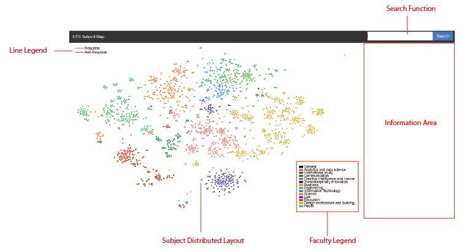

# CRS-NLP

A Prototype of Curriculum Relationship System 

Using Natural Language Processing to analyst document corpus from UTS curriculum outline 

TFIDF + T-SNE + JSON + D3.js 

Demonstration link: http://www-student.it.uts.edu.au/~jingylin/rp/

 

